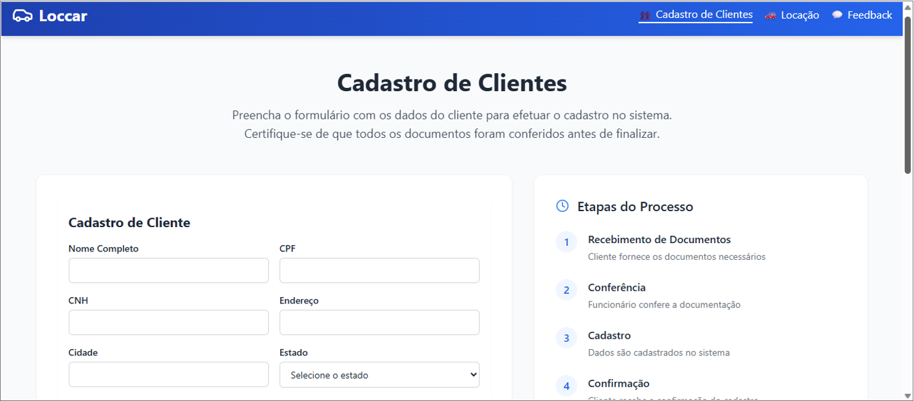
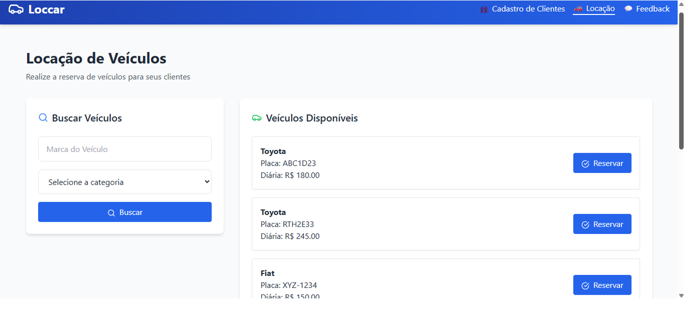
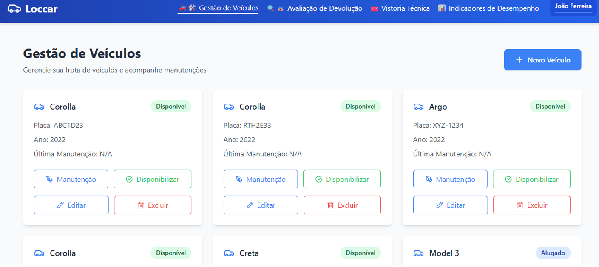
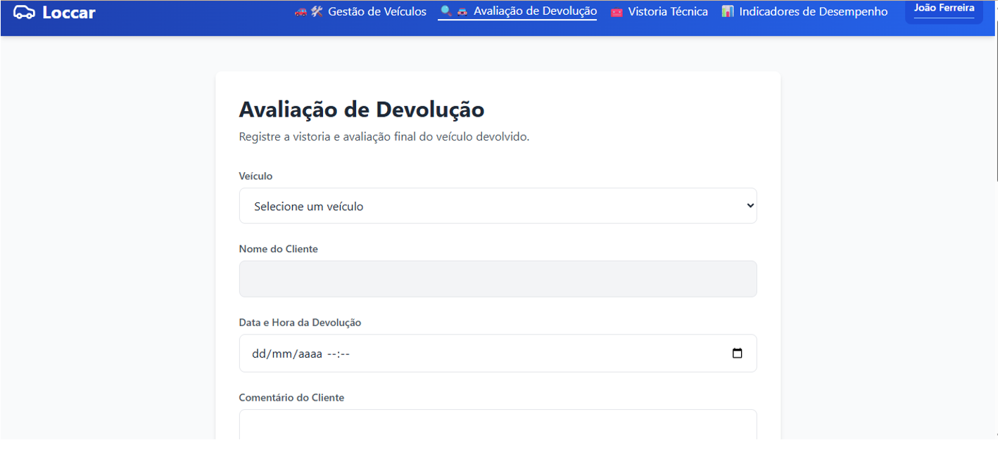
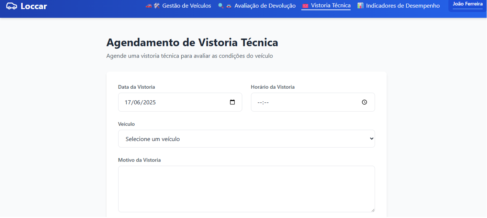

## 6. Interface do Sistema

Visão geral das principais telas dos processos da plataforma Loccar.

---

## 6.1. Telas do Processo 1 – Cadastro de Clientes

Esta tela permite cadastrar clientes no sistema. O usuário preenche dados como nome, CPF, CNH, endereço, cidade e estado.

**Elementos principais:**

- **Formulário de Cadastro:** Nome, CPF, CNH, endereço, cidade, estado.
- **Etapas do Processo:** Recebimento de documentos, conferência, cadastro e confirmação.
- **Botões:** Salvar, Voltar.

---

## 6.2. Telas do Processo 2 – Gestão de Carros

Tela utilizada para busca, cadastro e controle dos veículos, além do gerenciamento de manutenção e disponibilidade.

**Elementos principais:**

- **Campos de busca:** Marca e categoria do veículo.
- **Lista de Veículos:** Informações como marca, placa, valor da diária.
- **Botões:** Buscar, Reservar.

---

## 6.3. Telas do Processo 3 – Locação de Veículos

Tela destinada à reserva e locação de veículos. Permite visualizar veículos disponíveis, gerar contratos e registrar locações.

**Elementos principais:**

- **Lista de Veículos:** Informações do veículo, status (disponível, alugado, manutenção).
- **Botões:** Manutenção, Disponibilizar, Editar, Excluir.

---

## 6.4. Telas do Processo 4 – Avaliação de Devolução

Tela utilizada para avaliação final na devolução do veículo. Permite registrar a vistoria, eventuais danos e o feedback do cliente.

**Elementos principais:**

- **Campos:** Veículo, nome do cliente, data/hora da devolução, comentários.
- **Botões:** Salvar, Encaminhar para reparo, Confirmar.

---

## 6.5. Telas do Processo 5 – Vistoria Técnica de Veículos

Tela para agendar vistorias, preencher checklist, realizar análise e liberar o veículo ou encaminhar para reparo.

**Elementos principais:**

- **Campos:** Data da vistoria, horário, veículo, motivo.
- **Checklist:** Estado dos pneus, quilometragem, condições gerais, necessidade de reparo.
- **Botões:** Agendar, Salvar checklist, Aprovar, Reprovar.

