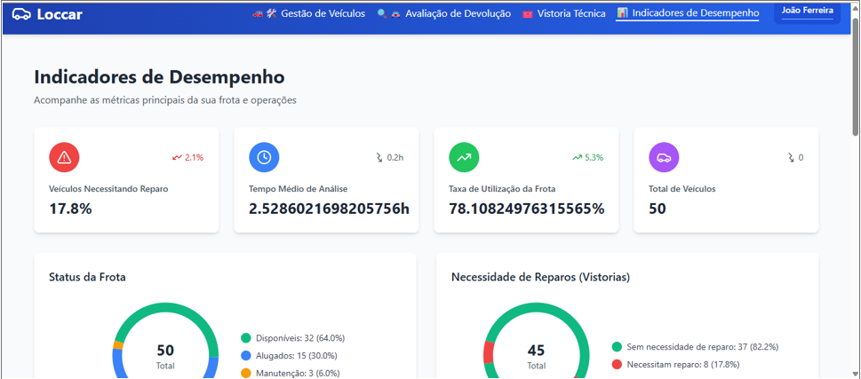

## 5. Indicadores de desempenho

| **Indicador**                                | **Objetivos**                                  | **Descrição**                                                                  | **Fonte de dados**   | **Fórmula de cálculo**                                                                 |
|----------------------------------------------|------------------------------------------------|--------------------------------------------------------------------------------|----------------------|----------------------------------------------------------------------------------------|
| Percentual de veículos que necessitam reparo | Avaliar a condição geral da frota              | Mede a proporção de vistorias que resultam em necessidade de reparo            | Tabela Checklists    | (número de vistorias com "Necessita reparos = Sim" / número total de vistorias) * 100 |
| Tempo médio de análise do checklist          | Verificar a eficiência da análise do gerente   | Mede o tempo médio entre o preenchimento do checklist e a análise do gerente   | Tabela Checklists    | soma de (data/hora da análise - data/hora do preenchimento) / número total de análises |
| Taxa de utilização da frota                  | Otimizar o uso dos veículos disponíveis        | Mede a proporção de veículos em uso em relação ao total disponível             | Tabela Veículos      | (número de veículos em uso / número total de veículos disponíveis) * 100             |

##  Tela de Indicadores de Desempenho

Tela destinada ao acompanhamento dos principais indicadores operacionais da frota.

**Elementos principais:**

- **Veículos Necessitando Reparo:** Percentual e quantidade de veículos que estão com status de reparo.
- **Tempo Médio de Análise:** Tempo médio gasto nas análises e processos operacionais.
- **Taxa de Utilização da Frota:** Percentual que representa o quanto a frota está sendo utilizada.
- **Total de Veículos:** Quantidade total de veículos cadastrados na plataforma.
- **Gráficos:** 
  - **Status da Frota:** Distribuição entre Disponíveis, Alugados e em Manutenção.
  - **Necessidade de Reparos:** Quantidade de veículos que precisam ou não de reparo.

